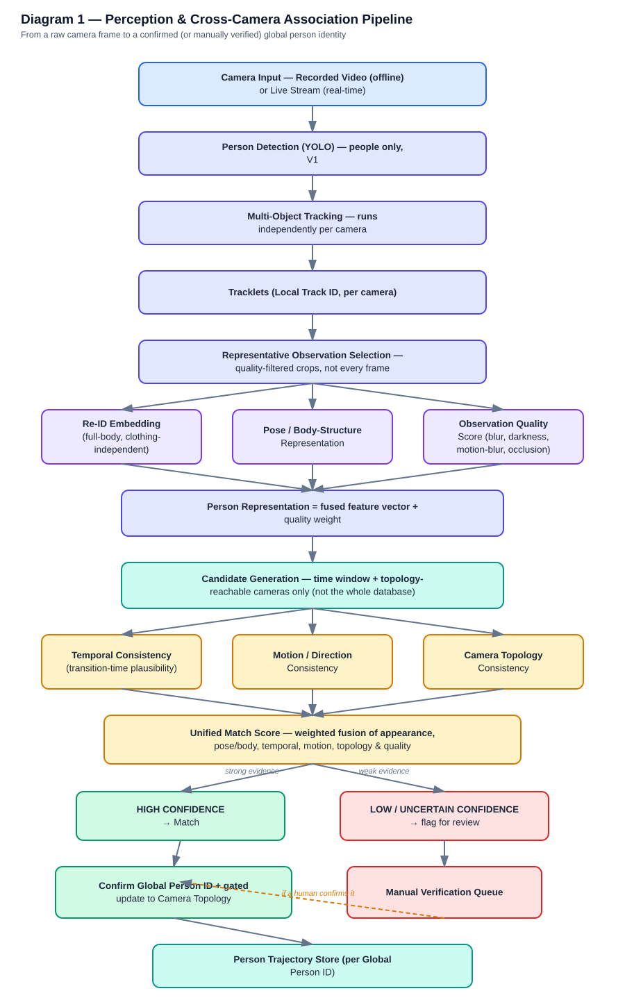
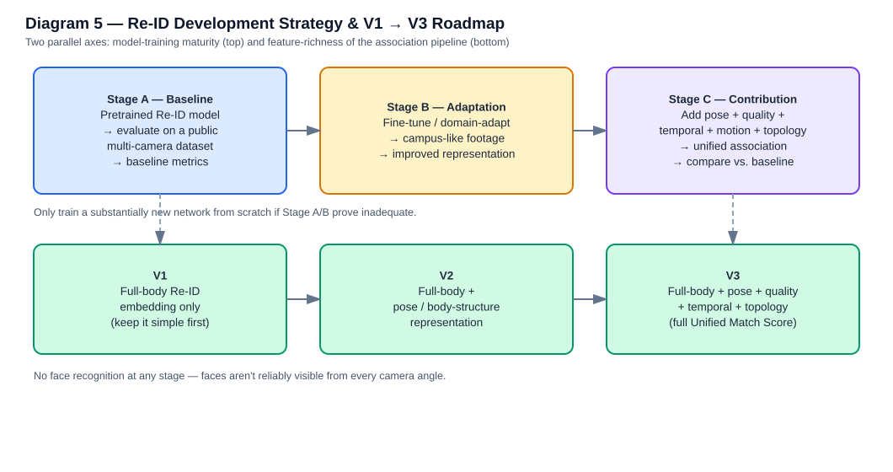
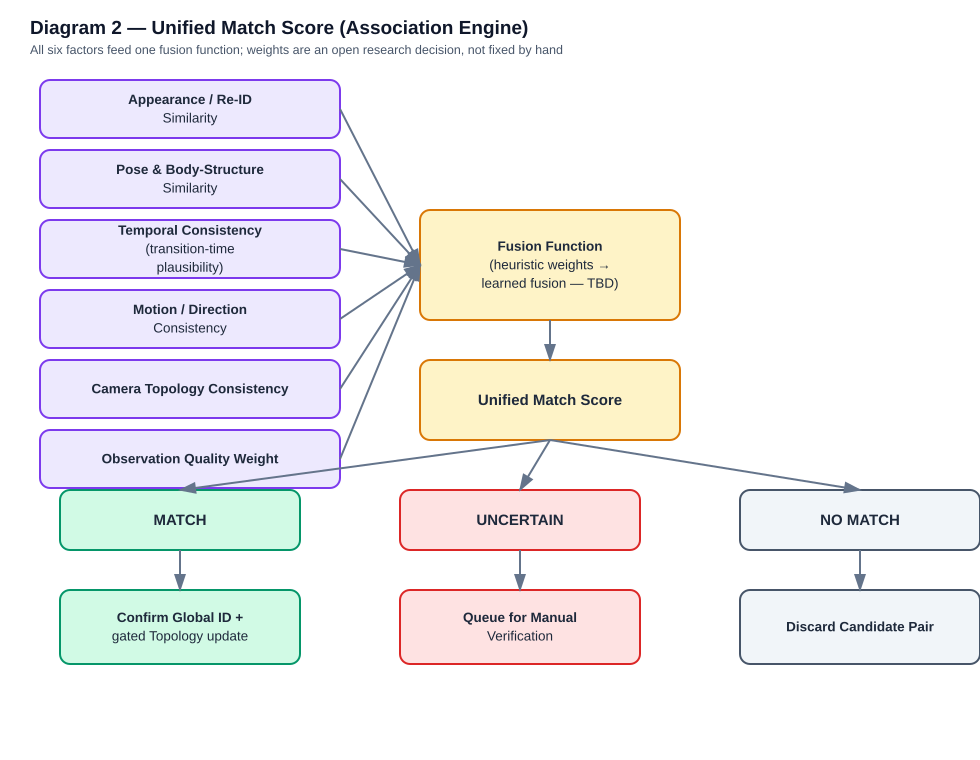
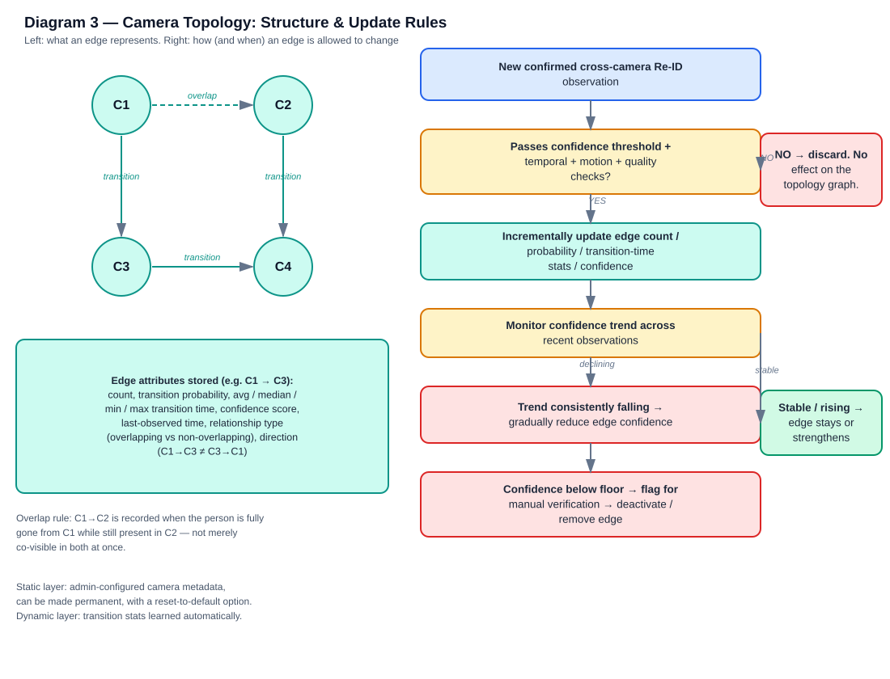
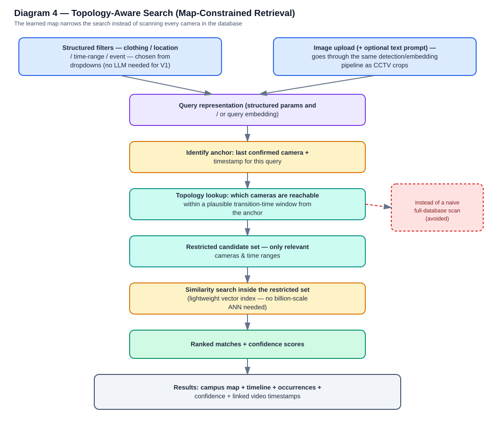

# Topology-Aware Multi-Camera Person Re-Identification & Search System
### Consolidated Project Definition & Pre-SRS/SDD Technical Blueprint — v1.0

---

## 0. About this document

Your discovery conversation ran through roughly 15 rounds and 90+ questions before you'd normally start writing an SRS/SDD. This document reorganizes everything you actually decided into one coherent reference, written the way a technical architect would hand it to a new team member: what the system is, what's locked, what's still open, and what to do next.

**A note on completeness, in the interest of accuracy:** the material you pasted contains the *full* Round 1 question framework (project title, one-line problem statement, the exact output the user sees, real-time-vs-offline, camera count, camera source, synchronization, overlap, physical topology knowledge, closed-set vs open-world identification, whether identities get named, team-member research breakdown) — but it does **not** contain the answers to those specific questions. It *does* contain fully worked answers for everything from dataset strategy onward (labelled Round 3 through Round 15 in your transcript: dataset, detection/tracking, quality, association, topology, calibration, search, fast search, storage, real-time/offline, hardware, and the final research question). So this document is built entirely from what was actually stated — nothing about title, exact problem sentence, camera count/sync, or team-member assignments has been invented. Every place where the answer wasn't in front of me is flagged explicitly in **Section 16**, not silently filled in.

---

## 1. Project Snapshot

| Item | Status |
|---|---|
| Working title | **Not yet fixed** — team is not describing this as generic "multi-camera Re-ID" but as a *topology-aware* multi-camera Re-ID and search system (see Section 3) |
| Team size | 4 members |
| Deliverables required | SRS, then SDD |
| Current phase | Requirements discovery is essentially complete. Next phase is **technical design** (dataset, model, algorithm, schema, API selection) — not more open-ended questions |
| Project scale | Both a research contribution *and* a working, demoable application (Option D from the original framework) |
| Timeline signal | References to "this month's demo" and a "final 5-month system" imply a multi-month build with incremental monthly milestones — exact dates not confirmed (see Section 16) |
| Hardware | Base laptops are integrated-graphics only, but the team can get NVIDIA GPU laptops through friends and possibly lab access for training — explicitly **do not scale back the design** because of the base hardware |
| Deployment | Docker, as the standard best-practice choice |

---

## 2. Problem & Vision

**The team's own description of the project** (their words, from the final round): *"We are using a topology-aware multi-camera Re-ID system — we search based on topology and we plot the map using the learned map."*

Reconstructed mission, based on everything decided downstream: the system watches people move through a set of campus CCTV cameras, re-identifies the same person as they cross from one camera's view to another (even though the cameras don't overlap, lighting differs, and everyone wears a similar uniform), and lets a user search for a specific person's movements across the whole camera network — using the *learned relationships between cameras* to make that search fast and to make cross-camera identity decisions more reliable, rather than treating appearance-matching as the only signal.

What makes this **not** a generic Re-ID project:

> Normal Re-ID asks: *"Does this look like the same person?"*
> This system asks that, **plus**: *"Could this person logically have moved from that camera to this one?"*, *"Does the timing make sense?"*, *"Does the direction of motion make sense?"*, and *"How reliable is this particular image?"* — then fuses all of that into one confidence score, and feeds confirmed answers back into a live map of how the campus's cameras relate to each other.

**Confirmed final output surfaced to a user** (inferred from the fully-specified architecture in Section 4, since Q4's direct answer wasn't in the pasted text): a **campus map + timeline view** showing a person's confirmed trajectory across cameras, **plus** a **search interface** (structured filters or an uploaded image) that returns ranked occurrences with confidence scores and linked video timestamps. This matches "Option D — all of the above" from the original Q4 framework, not just a single ID readout.

---

## 3. Research Question & Contributions

**Confirmed research question** (the team explicitly signed off on this): *"Can topology-aware, quality-aware, spatiotemporal cross-camera association improve person Re-ID accuracy and search efficiency in a multi-camera campus environment?"*

**A refinement worth formally adopting** (proposed, not yet re-confirmed by the team): tightening this to explicitly name the search-space-reduction mechanism —
*"Can topology-aware, quality-aware and spatiotemporal cross-camera association improve person Re-ID accuracy and search efficiency **by constraining candidate camera transitions** in a multi-camera campus environment?"*
This captures the map-constrained search idea (Section 11) that turned out to be one of the project's strongest ideas. Worth a two-minute team confirmation before it goes into the SRS.

**Four research contributions** (the team selected "a combination" of contribution options; here is how they cash out concretely — note the original option list itself wasn't in the pasted text, so this is the retrospective mapping only):

1. **Automatic camera-topology learning** — learning camera-to-camera transition relationships from confirmed observations, not from a hand-specified physical map.
2. **Topology-aware cross-camera association** — using that learned topology to constrain and re-rank candidate identity matches.
3. **Quality-aware association** — down-weighting (not discarding) blurry, dark, motion-blurred, or occluded observations.
4. **Efficient, topology-constrained similarity search** — searching only the cameras/time-windows the topology says are reachable, instead of the whole database.

**What the team explicitly does *not* want this framed as:** a "clothing-aware Re-ID" system in the narrow sense of clothing being a primary matching factor. Clothing is one minor signal among several (appearance, body structure/pose, motion, quality) — not the deciding one — precisely because campus uniforms make clothing unreliable for distinguishing people.

---

## 4. System Architecture Overview



This is the backbone of the whole system: camera input → detection → per-camera tracking → tracklets → representative-observation selection → three parallel feature extractors (Re-ID embedding, pose/body representation, quality score) → a fused person representation → topology-constrained candidate generation → three parallel consistency checks (temporal, motion, topology) → the Unified Match Score → a three-way outcome (confirm / manual review), with topology updates gated behind confirmed, high-confidence matches only.

Two subsystems build on top of this backbone and are diagrammed separately because each has its own decision logic:
- **The Camera Topology model** (Section 10, Diagram 3) — how relationships between cameras are represented, learned, protected from bad matches, and allowed to decay.
- **The Search system** (Section 11, Diagram 4) — how a user query gets turned into a topology-constrained, not database-wide, retrieval.

---

## 5. Data Strategy

**Two-tier dataset approach, confirmed:**

| Tier | Purpose | Details |
|---|---|---|
| Public multi-camera dataset | Algorithm development + **quantitative** evaluation | Gives you rigorous, comparable numbers (train/test split, no leakage) |
| Own recorded campus-like footage | **Final demonstration** / domain-transfer showcase | 3–4 cameras, ~10 min/camera (realistic capacity), ~5 people, same people can walk multiple routes |

**Critical rule locked in:** don't call the campus footage an "independent evaluation set" if any of it was used in training. If you later decide to fine-tune on some campus footage, you need proper campus train/val/test splits and the test portion must never touch training.

**Own-footage conditions to script for** (confirmed as feasible, going into a formal recording protocol):
- Same uniform, different people ✅ (this is the hard case your project has to prove it can handle)
- Different lighting ✅
- Opposite walking directions ✅
- Overlapping cameras ✅
- Long gaps between camera appearances ✅
- People stopping ✅
- People changing direction ✅
- Low-quality footage ✅
- Different clothing, same person ⚠️ flagged as difficult to arrange — likely lower priority, not a core scripted scenario

**Ground truth:** manually recorded identity + entry/exit timestamps for every scripted route.

**Recommended recording-protocol format** (this follows directly from what you locked in — a per-participant walking script, not "everyone just walk around"):

```
TEST SCENARIO 0X
Person: P0x        Route: C1 → C2 → C3
Direction: forward/opposite   Speed: normal/fast
Clothing: uniform / varied    Condition: normal / occlusion / low-light / etc.
```

Recording this table alongside the footage is what makes your later evaluation numbers credible to an evaluator.

---

## 6. Detection & Tracking

Confirmed pipeline: **frame → person detection → bounding boxes → multi-object tracking → local track ID → tracklet.**

- **Detection scope:** people only for V1 — no other object classes.
- **Detector:** YOLO is already available to the team; exact version/config still TBD (Section 16).
- **Tracking:** runs **independently per camera** — cross-camera identity is Re-ID's job, not the tracker's.
- **Track continuity:** a track is allowed to continue through a short occlusion/disappearance rather than being killed immediately.
- **Local Track ID vs. Global Person ID — an important distinction to keep in the SDD:** `C1_Track_01` and `C3_Track_17` are local, per-camera identifiers. Re-ID decides whether they refer to the same real-world person; only then do they both get folded into one `Person_007` global identity.

---

## 7. Person Representation & Re-ID Strategy



**The single biggest correction from your discovery process:** you initially assumed pretrained Re-ID models "aren't publicly available" and that a from-scratch network would be required. That's not accurate — publicly available pretrained person-Re-ID toolboxes and model zoos do exist. The corrected, staged strategy:

- **Stage A — Baseline:** evaluate an existing pretrained Re-ID model on the public dataset → baseline metrics.
- **Stage B — Adaptation:** fine-tune/domain-adapt that model using your own available training data.
- **Stage C — Contribution:** only *then* layer in pose/body structure, quality, temporal consistency, motion, and topology to build the project's actual unified association system, and compare it against the Stage A/B baseline.
- **Train a substantially new network from scratch only if Stage A/B experiments show existing approaches are genuinely inadequate.** This preserves a strong "baseline vs. our contribution" comparison for your final report, instead of "we trained a neural network" with nothing to compare it to.

**Feature philosophy, confirmed:**
- Person representation = appearance **+ body structure + pose + shape** + other robust visual features. Clothing is one minor feature, never the deciding one — a direct response to the uniform problem.
- **No face recognition**, at any stage. Reasoning locked in by the team: faces aren't reliably visible from every camera angle in a fixed CCTV setup, making face-based identity unreliable here.
- **Full-body embedding first (V1)** — no part-level (head/arm/leg/shoe) embeddings yet, to keep V1 achievable.
- **Progression path:** V1 (full-body only) → V2 (+ pose/body-structure) → V3 (+ quality + temporal + topology = the complete Unified Match Score).

---

## 8. Quality Assessment

Confirmed rule: **quality is a weighting factor, never a hard filter.**

- Excellent-quality observation → trust its embedding strongly (high contribution to matching).
- Poor-quality observation → **don't discard it** — assign it low weight *and* flag it for manual verification, since it may still carry useful information.
- Degrading factors identified: **blur, darkness/low light, motion blur, occlusion.**
- Conceptually: `similarity score × quality modifier → adjusted evidence strength`. The same 0.82 similarity means "strong evidence" at excellent quality and "considerably less trustworthy" at very poor quality.

---

## 9. Unified Cross-Camera Association (Matching Engine)



**Confirmed design:** one fusion function combining **all six factors** — appearance/Re-ID similarity, pose/body similarity, temporal consistency, motion/direction consistency, camera-topology consistency, and observation quality — into a single **Unified Match Score**, plus any additional factor that proves useful during experimentation.

- **Decision path:** topology and Re-ID are used **together**, not sequentially (topology never gets picked before Re-ID or vice versa — this was an explicit choice among the options presented).
- **Three-way outcome, not binary:** Match / Uncertain / No Match. "Uncertain" routes to manual verification rather than being forced into a match/no-match guess.
- **Open item, not yet decided:** the fusion weights. The team has explicitly rejected hand-picking arbitrary percentages (e.g. "30% appearance, 20% pose") — weights should come from experimentation, validation, or a learned fusion mechanism. This is real, unclaimed research work for the team (see Section 16).

---

## 10. Camera Topology Model



**Edge semantics, confirmed:** `C1 → C3` means the person is genuinely gone from C1's view and later appears in C3.

**Overlapping-camera case, precisely defined:** when C1 and C2 have overlapping fields of view, the `C1 → C2` relationship is recorded specifically when the person becomes **completely gone from C1 while still present in C2** — not simply from momentary co-visibility in both. This is a real distinction the topology model needs to encode (an edge "type": overlapping vs. non-overlapping), because the transition-time statistics for the two cases behave differently.

**What an edge stores:** transition count, transition probability, average/median/min/max transition time, a confidence score, last-observed time, relationship type (overlapping/non-overlapping), and direction (`C1→C3` is tracked separately from `C3→C1`). "All useful features, drop only what's proven not useful" is the standing policy — the feature set is meant to grow or shrink based on evidence, not be frozen up front.

**The circular-dependency problem, and how it's solved:** if Re-ID uses topology to help match people, and topology is learned *from* Re-ID matches, a single wrong match can poison the topology, which then biases future matches to be wrong in the same way. The gating rule that prevents this:

- **Re-ID identity confidence must be established *before* an observation is allowed to update the topology** — topology updates are strictly downstream of confirmed Re-ID, never the reverse.
- If a match is wrong, or below the confidence threshold, it **must not** update the topology graph and must not contribute to topology-building at all — this is a hard gate, not a soft down-weighting.
- **Update mechanism:** each new sufficiently-strong confirmed observation updates the graph's statistics/confidence incrementally (the team's stated preference leans toward live, per-observation updates rather than periodic batch recomputation — though the exact update cadence for numerical stability is still worth formalizing; see Section 16).
- **Decay and removal:** if an edge's confidence consistently declines under repeated non-supporting evidence, it should be allowed to weaken and eventually be deactivated — but only via **manual verification before permanent removal**, not silent automatic deletion.

**Calibration / plausibility filtering:**
- A **minimum transition time** acts as a hard sanity filter — if a "transition" between two specific cameras happens faster than physically possible for that pair, it's treated as implausible and filtered out rather than accepted as evidence.
- **Deliberately rejected:** modeling real-world physical/geographic distance between cameras. **Chosen instead:** pure topological connectivity + empirically observed transition-time statistics. This is a lighter, more robust representation that doesn't require accurate physical surveying of the campus.

**Two-layer control model:**
- **Static/admin layer:** an administrator manually configures camera metadata (location, orientation, overlap flags, enabled/disabled) and can mark a configuration permanent. Crucially, there must be a **reset-to-default** mechanism in case the admin misconfigures something.
- **Dynamic/learned layer:** transition statistics, confidence, and decay are learned automatically from confirmed observations, constrained by the static layer above it.

---

## 11. Search & Query System



**LLM decision — resolved for V1:** an LLM is **not required**. A structured, dropdown/field-based query UI (clothing, location, time range, event type) is faster, deterministic, easier to debug, and easier to demo than natural-language parsing — and this was the team's own stated concern (latency/lag) that the structured approach directly avoids. An LLM remains available as a **purely optional future interface layer** that only translates natural language into the same structured parameters — it never touches the CCTV pipeline or the vector search directly, so the expensive path stays deterministic either way. Leave it out of this month's demo entirely.

**Confirmed query capabilities:**
- Structured filters via dropdowns: clothing, location, event, start time, end time.
- Image-based query: user uploads an image of the person (not necessarily a face crop), optionally with a text prompt for extra precision. The uploaded image passes through the **same detection → embedding pipeline** as live camera crops, so the query lands in the same feature space as everything stored.
- Time-range and location filtering are both supported.

**The project's real differentiator (the "Addon" idea) — map-constrained search:** rather than searching the entire database of every camera, the search should use the **learned camera topology** to restrict the search space to only the cameras that are logically reachable, within a plausible time window, from wherever the person was last confirmed. This is not a UI nicety — it's a search-space-reduction mechanism baked into the algorithm itself, and it's arguably the single strongest idea to lead with in your SRS's "why this is novel" section.

---

## 12. Storage, Embeddings & Data Retention

**Embedding storage — corrected design:** don't store an embedding for literally every detected frame (10,000 frames → 10,000 embeddings is wasteful), but also don't store embeddings *only* reactively at query time (future queries are unknown in advance, so historical coverage would be incomplete). The resolved middle ground: for every tracklet, select and embed a small number of **representative, quality-filtered observations** — each stored with its embedding, quality score, camera, timestamp, track ID, and (once confirmed) global person ID.

**Search-time behaviour:** after one detection/identity is anchored, subsequent candidate detections are searched according to time constraints *and* narrowed by the topology/map — reinforcing the map-constrained search design from Section 11.

**Scale:** the team does not expect billion-scale search volume — a lightweight/moderate-scale vector index (e.g. something in the FAISS family) should be sufficient; no web-scale ANN infrastructure needed. This is provisional and may evolve.

**Historical data retention — recommended and accepted:**
- **Retain processed metadata long-term** (tracklets, embeddings, association results, trajectories) — deleting this makes historical queries like "where was Person_007 four months ago?" unanswerable.
- **Raw video can follow a separate, shorter/configurable retention policy** — you don't need to keep every raw frame forever, only the derived metadata/embeddings.
- For the academic prototype: retain the complete experimental dataset. A real deployment would need an explicit privacy/retention policy, which is flagged as future scope beyond the prototype rather than something to design now.

---

## 13. Real-Time vs. Offline Processing

**Confirmed architecture:** one shared core pipeline (detection → tracking → Re-ID → association → topology → DB → search), with the input source (recorded video vs. live stream) as a **user-selectable mode**, not two separately-built systems.

**Sequencing, confirmed:** build the **offline** system first — it removes real-time engineering constraints and lets the core algorithms mature. Progress **offline → near-real-time → real-time** only as performance allows, rather than letting real-time engineering consume the whole project. The near-term (this month's) demo target is understood to be the offline-first, common-core version; real-time is a later-stage stretch goal within the ~5-month timeline.

---

## 14. Hardware & Deployment

- **Base hardware:** integrated-graphics-only laptops. **Explicit instruction: do not scale back features or architecture because of this** — the team can access NVIDIA GPU laptops via friends and potentially lab machines for training and heavier compute. Design for the ideal system; solve hardware access as a logistics problem, not a design constraint.
- **Deployment:** Docker, chosen as the best-practice standard rather than for a specific technical requirement.

---

## 15. Locked Decisions — Quick Reference

| Area | Decision |
|---|---|
| Detection scope | People only (V1) |
| Tracking | Independent per camera; short-gap continuity allowed |
| Re-ID base strategy | Pretrained baseline → fine-tune/adapt → add contribution (never "train from scratch" as a first move) |
| Re-ID representation | Full-body first; pose/body-structure added in V2; no face recognition, ever |
| Clothing's role | Minor signal only — never the deciding factor (campus uniforms) |
| Quality handling | Weight down, don't discard; flag poor quality for manual review |
| Matching | Single Unified Match Score fusing 6 factors; Match / Uncertain / No-Match; fusion weights TBD |
| Topology gating | Re-ID confidence confirmed **before** topology update; weak/wrong matches never touch the graph |
| Topology update | Incremental per strong observation; decay + manual-verified removal for consistently unsupported edges |
| Topology math | Connectivity + transition-time statistics — **not** physical distance |
| Camera config | Admin-controlled static layer (with reset) + automatically learned dynamic layer |
| Search UI | Structured dropdowns for V1; LLM optional/deferred, translation-only if added later |
| Search scope | Topology-constrained candidate set, not full-database scan |
| Query modes | Structured filters + image upload (with optional text) |
| Storage | Representative per-tracklet embeddings, not per-frame; moderate-scale vector index |
| Retention | Metadata/embeddings long-term; raw video shorter/configurable; prototype retains everything |
| Processing mode | Shared core pipeline; offline built first, real-time as stretch goal |
| Hardware stance | Don't compromise design for base hardware; arrange GPU access instead |
| Deployment | Docker |

---

## 16. Open Items — What Still Needs Deciding

This is the honest gap list. Some of these are things the earlier discovery process itself flagged as "next phase" work; others are things this synthesis surfaced because the answer wasn't present in what was shared with me.

### 16.1 Carried over from Round 1/2 — not answered in what was shared
- [ ] **Exact project title** (working title only exists as a description, not a fixed name)
- [ ] **One-sentence problem statement** in the team's own words ("Our system should be able to ___")
- [ ] **Confirmed final camera count** for the *real* target deployment (the 3–4 camera figure is confirmed only for the recording prototype)
- [ ] **Camera clock synchronization** — are/will the cameras' timestamps be genuinely synchronized, or does the system need to handle clock drift?
- [ ] **Closed-set vs. open-world identification** — does the system ever map a `Person_00X` to a real student ID/name, or does it stay fully anonymized? This has real privacy-scope implications for the SRS.
- [ ] **Team-member research assignment breakdown** — which of the 4 members owns which research thread (detection/tracking, Re-ID, topology/search, backend/infra are the natural split given the architecture, but this hasn't been explicitly assigned in what was shared)

### 16.2 Technical design decisions (the next phase of work)
- [ ] Which public multi-camera dataset(s) to use for Stage A/B (see Section 17 for concrete starting candidates)
- [ ] Exact detector config/version (YOLO variant, input resolution, confidence thresholds)
- [ ] Tracker choice (e.g. ByteTrack-class algorithm) — mentioned as a candidate technology earlier but not confirmed
- [ ] Baseline Re-ID architecture/model choice for Stage A
- [ ] Whether pose estimation measurably improves association (needs an actual experiment, not just intuition)
- [ ] Fine-tuning methodology: loss function, training schedule, data augmentation strategy
- [ ] Exact embedding dimensionality and representative-observation selection rule (how many crops per tracklet, chosen how)
- [ ] The fusion function for the Unified Match Score — heuristic weights vs. a learned fusion layer, and how it's validated
- [ ] Formal mathematical representation of the topology graph (data structure, exact statistics tracked, decay function)
- [ ] The concrete topology-aware candidate-search algorithm (how "reachable within a plausible time window" is computed at query time)
- [ ] How minimum/typical transition times are derived — data-driven from observations, admin-seeded, or both
- [ ] Concrete confidence thresholds for the topology-update gate (Section 10)
- [ ] Vector database/index choice (FAISS or equivalent — family is implied, product not chosen)
- [ ] Database schema design
- [ ] Backend/API design
- [ ] Frontend/map implementation approach
- [ ] Concrete offline pipeline architecture/orchestration
- [ ] Concrete real-time pipeline architecture/orchestration (stretch goal)
- [ ] Evaluation metrics and experiment design (e.g. Re-ID rank-1/mAP-style metrics, plus whatever's appropriate for measuring topology and search-efficiency gains)
- [ ] What exactly the 3–4 camera prototype must demonstrate *this month*
- [ ] What the full 5-month system must demonstrate at final submission
- [ ] Tech stack confirmations beyond what's locked — PyTorch, FastAPI, React, PostgreSQL were raised as candidates earlier but not individually confirmed (only YOLO and Docker are confirmed)

---

## 17. Recommended Immediate Next Steps

1. **Close the Round 1/2 gaps first** (Section 16.1) — these are quick to answer and everything else, including the SRS's scope section, depends on them. Fastest path: a short, focused 20-minute team discussion, not another 20-question round.
2. **Assign the technical-design items in Section 16.2 across the 4 team members**, following the natural seams in the architecture: (a) detection/tracking, (b) Re-ID model + training, (c) topology + association + search, (d) backend/database/API/UI. This also finally answers the outstanding "what did each member research" question in a way that maps onto real deliverables.
3. **Start the dataset/model literature review now**, since it blocks Stage A of the Re-ID strategy. A few concrete, verifiable starting points for that review (not a final choice — verify current licensing/availability before committing):
   - **Multi-camera datasets with both overlapping and non-overlapping zones** — the closest published match to your own scenario is the **MTA dataset** (a simulated, GTA V-based multi-target multi-camera pedestrian dataset with ~2,800 identities across 6 cameras and over 100 minutes of footage per camera, released with open code and a baseline tracker). Its own baseline system — detection → Re-ID → per-camera tracking → a *weighted aggregation* of single-camera time constraints, multi-camera overlap constraints, appearance distance, camera-homography matching, and motion prediction — is strikingly close to the Unified Match Score you've already designed, which is a good sign your design isn't reinventing something already known to be flawed.
   - **WildTrack** — 7 overlapping cameras with dense pedestrian traffic and 3D position ground truth; useful specifically for validating overlap-handling logic (Section 10).
   - **The "Campus" dataset** (Garden1/Parking Lot sequences, 4 calibrated cameras) — small-scale but topically on-point for a campus-style layout.
   - **Caution:** some historically popular Re-ID benchmarks (DukeMTMC in particular) were withdrawn years ago over consent/privacy concerns and shouldn't be used even if copies are still findable online — worth a quick licensing check on anything the team shortlists.
4. **Start the Re-ID baseline evaluation now, in parallel** with the dataset decision — publicly available pretrained Re-ID toolkits with full model zoos already exist (e.g. Torchreid/deep-person-reid and FastReID), so Stage A doesn't need to wait on a training pipeline being built from scratch; it can start as "download a pretrained model, run it on a public dataset, record baseline numbers" within days.
5. **Draft the recording protocol table (Section 5) now**, even before cameras are finalized — assigning routes/conditions/speeds to each of the 5 participants takes real planning time and doesn't depend on any of the technical decisions above.
6. **Hold the reworded research question (Section 3) up for a 2-minute team confirmation** before it goes into the SRS, since it wasn't explicitly re-confirmed after being proposed.

Once 16.1 and enough of 16.2 are resolved to name concrete tools/models, the SRS can be drafted directly from Sections 2–14 of this document (they're already written at requirements-level), and the SDD can follow once the architecture in Section 4 has concrete technology names attached to every box.

---

## 18. Diagram Index

| File | Shows |
|---|---|
| `pipeline_perception_association.svg` | Diagram 1 — full pipeline from camera input to confirmed global identity |
| `unified_match_score.svg` | Diagram 2 — the six-factor fusion model behind the Unified Match Score |
| `camera_topology_model.svg` | Diagram 3 — edge semantics/attributes, plus the update-and-decay gating rules |
| `topology_aware_search.svg` | Diagram 4 — how a query gets narrowed by the learned topology instead of scanning everything |
| `reid_staged_strategy.svg` | Diagram 5 — the Stage A/B/C Re-ID development plan and the V1→V3 feature roadmap |

*(These cover the architecturally load-bearing diagrams from the conversation. The many smaller illustrative sketches in the original discussion — single-example scenarios, tiny ASCII arrows — were folded into the prose above rather than each redrawn individually, to keep this document usable rather than exhaustive.)*
